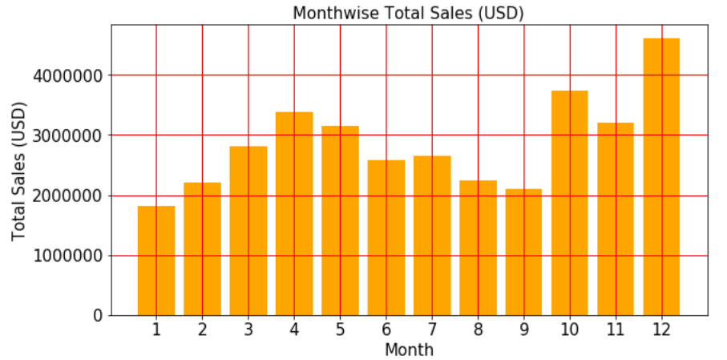
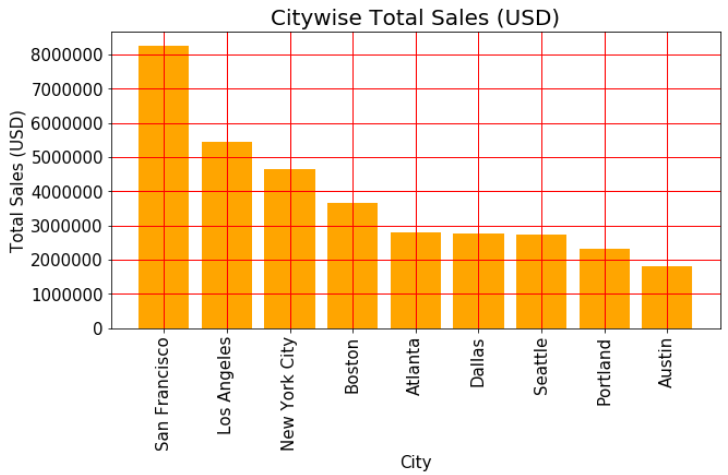
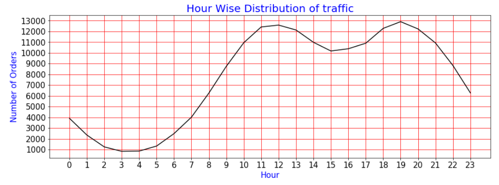

<h1> Sales-Analysis </h1>
<h2> Table of Content </h2>

<ul>
  <li><a href='#overview'>Overview</a></li>
  <li><a href='#motivation'>Motivation</a></li>
  <li><a href='#analysis'>Analysis Highlights</a></li>
  
</ul> 
  

<h2 id = 'overview'> Overview </h2>

This project answers 5 questions regarding the Sales Data (year 2019) of an Electronic Store based out of several cities in the United States of America. 
I have used the Python Libraries Pandas and Matplotlib for answering the following 5 questions :
  <ul>
  <li> What was the best month for sales? How much money was earned in that months?</li>
  <li> What city had the highest number of sales?</li>
  <li> At what time should we display advertisements to maximize the liklihood of customer's buying product?</li>
  <li> What are the products that are most often sold together?</li>
  <li> What product was sold the most? Any insights would be appreciated..</li>
  </ul>

The first part of the process was to combine the raw data which was available to us in 12 csv file for the 12 months into 1 DataFrame. After this, the data had to be cleaned, converted into respective data types and new columns had to be derived from existing columns before proceeding with the analysis.

 

<h2 id = 'motivation'> Motivation </h2>

I started pursuing Post Graduate Program in Data Science Engineering at Great Learning during the pandemic in 2020. After we had covered Numpy Pandas and Visualization using Matplotlib and Seaborn in September 2020, I realised that theory and labs don't have any impact as long as one doesnot have handson experience with real life messy data. So I decided to take on a dataset from kaggle and get my hands dirty! 
  
This particular category (sales dataset) caught my attention because my first clear understanding (or so I thought back then!) about what objectives that data science achieved came from an article by <a href= 'https://www.nytimes.com/2004/11/14/business/yourmoney/what-walmart-knows-about-customers-habits.html'>New York Times</a>. The idea that Data Science could find the pattern between a hurricane occurance and sale of strawberry Pop-Tarts increasing seven times was very overwhelming at the time! Little did I know this was just the tip of the iceberg.

 

<h2 id = 'analysis'> Analysis Highlights </h2>

The first part of the process was to combine the raw data which was available to us in 12 csv file for the 12 months into 1 DataFrame. After this, the data had to be cleaned, converted into respective data types and new columns had to be derived from existing columns before proceeding with the analysis.

 
<h3> 1) What was the best month for sales? How much money was earned in that months? </h3>
  

      
    The highest sales occurs in the month of December. This surely doesnot come as a surprise owing to Christmas and New Year shopping spree.
  

  
 

<h3> 2) What city had the highest number of sales? </h3>
  

    
  
  
 

 

<h3> 3) At what time should we display advertisements to maximize the liklihood of customer's buying product? </h3>
  

      Although this question makes much more sense if we are given the time period of advertisement the client can afford, the peaks seem to appear at 12pm and 7pm. The store saw negligible traffic during the post midnight to early morning period.
    
  
  
 

 

<h3> 4) What are the products that are most often sold together? </h3>
  

      I have answered the question with two groups :  
  <ul>
  <li><h4> Top ten groups of Two Products sold Together </h4>
       
  </li>
     
    <li> <h4>Top ten groups of Three Products sold Together </h4>
      
    </li>
  </ul>
    
  
  
  

 

<h3> 5) What product was sold the most? Any insights would be appreciated.. </h3>
  

      This problem could be tackled by two approaches :  
  <ul>
  <li><h4> Total Quantity Ordered </h4>
       
  </li>
     
    <li> <h4>Total Sales </h4>
      
    </li>
  </ul>
    
  
  
  

